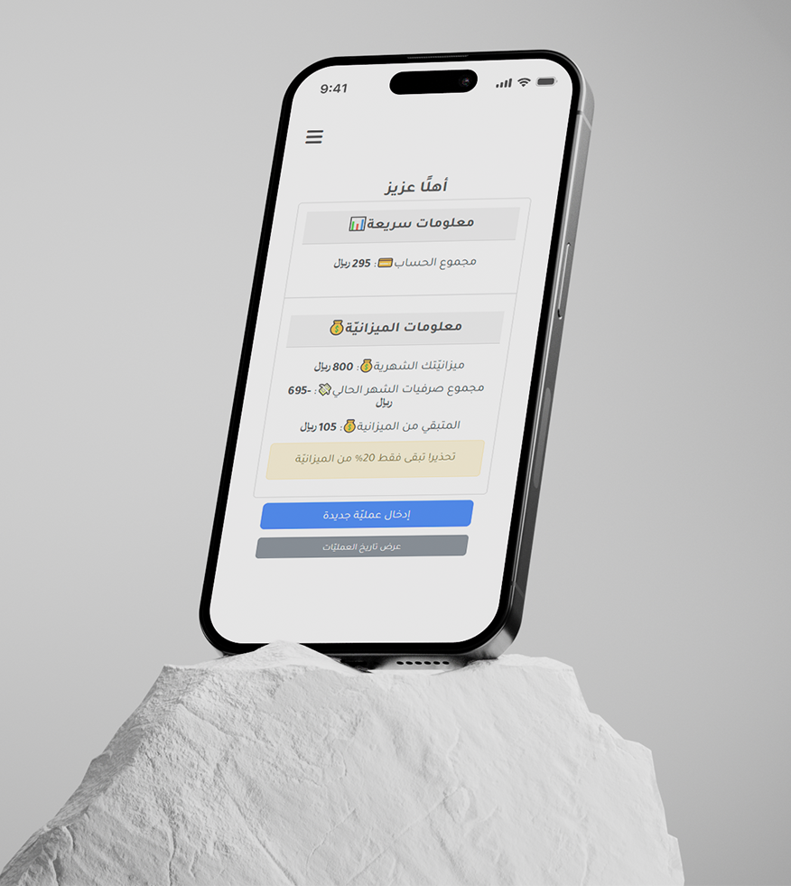
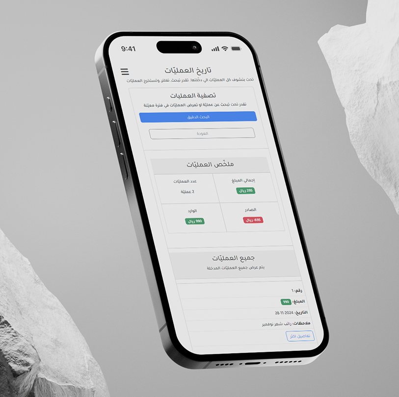
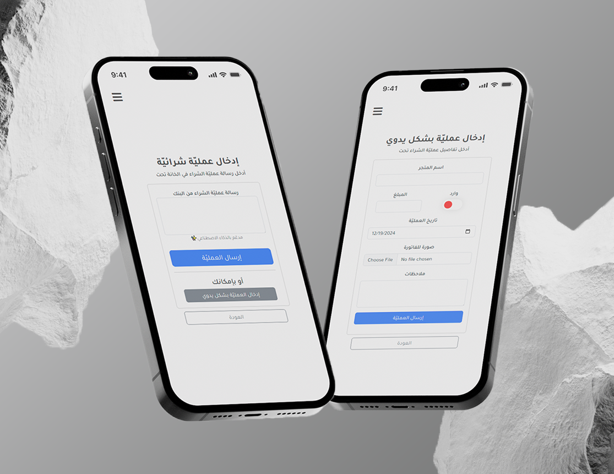

# Masrofi مصروفي



## About Masrofi

Masrofi is a personal expense tracking web application built with Laravel. It's the predecessor of [MasrofiSimple](https://github.com/CuzImAzizx/MasrofiSimple).

## What is Special About Masrofi?
- **Powered by AI**: Using AI model to analyze SMS transaction messages and extract essential information, such as store names, amounts, and dates for convenient and efficient use.
- **Advanced Searching/Filtering**: Easily query your transactions by name, filter within specific time periods, and search within designated amount ranges for enhanced financial tracking.
- **Valuable Insights**: You can view valuable insights of your transactions.
- **Transaction Extraction**: Easily export your transactions in PDF, CSV, or JSON formats for convenient data analysis and visualization.



## What Have Been Improved?

- **Built as a Laravel 11 application**: Compared to [MasrofiSimple](https://github.com/CuzImAzizx/MasrofiSimple), which is built with Express.js and EJS, Masrofi leverages the robust features of Laravel 11 for enhanced performance and scalability.

- **Supports multiple users**: Unlike [MasrofiSimple](https://github.com/CuzImAzizx/MasrofiSimple), which is a single-user application, Masrofi allows multiple users to manage their expenses concurrently.

- **Employs an actual relational database**: Instead of using a single JSON file (`db.json`), Masrofi integrates a relational database, providing better data management and integrity.

**Masrofi** now is using modern technologies, it's a multi-user robust web application for tracking personal expenses. With the ability to manipulate transactions efficiently.



## How to use Masrofi?

### Use the online version for free
You can create an account and start using Masrofi **for free** [here](https://masrofi.realaziz.xyz/). (Not at the moment)

### Self-hosting

If you prefer, you can run and host Masrofi on your own server. (Docker version coming soon)

#### Requirements
Make sure you have the following installed on your machine:
- git
- php 8.2
- composer
- Laravel
- Gemini API key ([Get one for free here](https://ai.google.dev/gemini-api/docs/api-key#:~:text=You%20can%20create%20a%20key%20with%20a%20few%20clicks%20in%20Google%20AI%20Studio))

### Installation steps

1. **Clone the Project**
```bash
git clone https://github.com/CuzImAzizx/Masrofi
cd Masrofi
```

2. **Install the Dependencies**
```bash
composer install
```

3. **Copy the Environment Configuration**
```bash
cp .env.example .env
```

4. **Generate an Application Key**
```bash
php artisan key:generate
```

5. **Add Your API Key in the `.env` File**
```bash
GEMINI_API_KEY=YOUR_KEY_HERE
```

6. **Database Configuration (Optional)**

You may choose to update the database configuration or keep the default settings, which utilize an SQLite database that requires no additional configuration.

7. **Run Migrations**
```bash
php artisan migrate
```
You may be prompted to create a new SQLite database. Confirm to create the database.

8. **Seed the Database with Initial Data**
```bash
php artisan db:seed
```

9. **Create Storage Links**
```bash
php artisan storage:link
```

10. **Run the Development Server**
```bash
php artisan serve
```
Visit `http://localhost:8000` in your web browser to view the application.

## Migrate from MasrofiSimple

You can easily migrate your transactions and configurations from the old MasrofiSimple app. The migrated transactions will retain their data, including store names, dates, and invoice images.

### Requirements
- **MasrofiSimple App Folder**: Ensure you have the app folder on your filesystem, which should include `db.json` and `.env`.
  
- **Masrofi**: The Masrofi app must be running and functional on your system alongside the MasrofiSimple app folder.

- **An account in Masrofi**: You need a user account in Masrofi to transfer your old transactions.


### Migration Steps

1. **Locate the MasrofiSimple Path**

   Copy the absolute path of your MasrofiSimple app folder that contains the transactions you want to transfer. For example: `/home/aziz/Documents/MasrofiSimple`.

2. **Get the User Email**

   Get the email address of the user to whom you want to transfer your old transactions to. For example: `aziz@mail.com`.

3. **Run the Migration Command**

   In your Masrofi app, execute the migration command:

   ```bash
   php artisan app:migrate-masrofi-simple "aziz@mail.com" "/home/aziz/Documents/MasrofiSimple"
   ```

    Replace the values with your own values

4. **Check the Transactions**

   Launch Masrofi, log in to your account, and verify that the transactions have been successfully transferred.